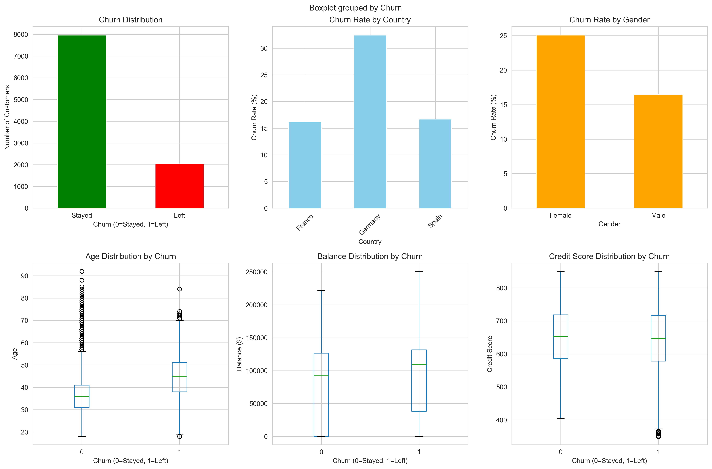
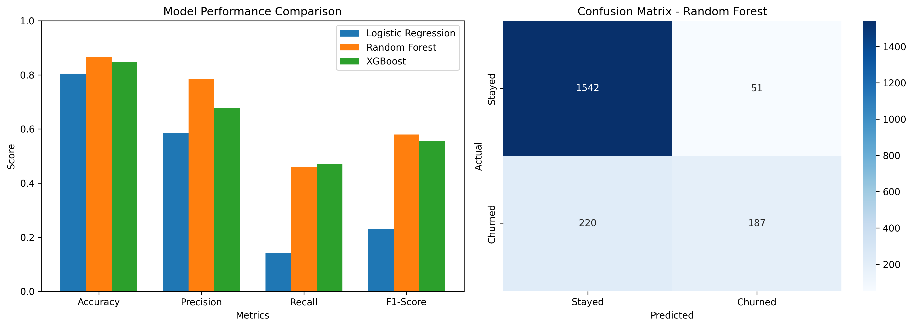

# 🏦 Customer Churn Prediction System

A machine learning web application that predicts whether a bank customer will leave (churn) or stay based on their profile.

## 🎯 Project Overview

This project uses supervised machine learning to predict customer churn for banks. It helps identify at-risk customers so businesses can take retention actions.

## 🚀 Features

- **3 ML Models**: Logistic Regression, Random Forest, XGBoost
- **Best Model**: Random Forest (86% accuracy, 58% F1-Score)
- **Web Interface**: Beautiful, responsive UI for predictions
- **Real-time Predictions**: Instant churn probability calculations
- **Risk Classification**: Low/Medium/High risk categories

## 📊 Dataset

- **Source**: Bank Customer Churn Dataset
- **Size**: 10,000 customers
- **Features**: 10 (Credit Score, Geography, Gender, Age, Tenure, Balance, etc.)
- **Target**: Churn (0=Stayed, 1=Left)

## 🛠️ Tech Stack

- **Backend**: Python, Flask
- **ML Libraries**: scikit-learn, XGBoost, pandas, numpy
- **Frontend**: HTML, CSS, JavaScript
- **Visualization**: matplotlib, seaborn

## 📁 Project Structure
```
customer-churn-prediction/
├── data/                      # Dataset and visualizations
│   ├── bank_churn.csv
│   ├── churn_analysis.png
│   └── model_comparison.png
├── models/                    # Trained ML models
│   ├── logistic_regression.pkl
│   ├── random_forest.pkl
│   ├── xgboost.pkl
│   ├── scaler.pkl
│   └── label_encoders.pkl
├── static/                    # CSS, JS files (if any)
├── templates/                 # HTML templates
│   └── index.html
├── app.py                     # Flask backend
├── train_model.py             # Model training script
├── explore_data.py            # Data exploration script
├── download_data.py           # Dataset download script
├── requirements.txt           # Python dependencies
└── README.md                  # Project documentation
```

## 🔧 Installation & Setup

### Prerequisites
- Python 3.8 or higher
- pip

### Steps

1. **Clone the repository**
```bash
   git clone https://github.com/YOUR_USERNAME/customer-churn-prediction.git
   cd customer-churn-prediction
```

2. **Create virtual environment**
```bash
   python -m venv venv
   source venv/bin/activate  # On Windows: venv\Scripts\activate
```

3. **Install dependencies**
```bash
   pip install -r requirements.txt
```

4. **Download dataset**
```bash
   python download_data.py
```

5. **Explore the data (optional)**
```bash
   python explore_data.py
```

6. **Train the models**
```bash
   python train_model.py
```

7. **Run the web app**
```bash
   python app.py
```

8. **Open in browser**
```
   http://127.0.0.1:5000
```

## 📈 Model Performance

| Model | Accuracy | Precision | Recall | F1-Score |
|-------|----------|-----------|--------|----------|
| Logistic Regression | 80.50% | 58.59% | 14.25% | 22.92% |
| Random Forest | 86.45% | 78.57% | 45.95% | **57.98%** |
| XGBoost | 84.70% | 67.84% | 47.17% | 55.65% |

**Winner**: Random Forest 🏆

## 🎯 Key Insights

1. **Geography Impact**: German customers have 2x higher churn rate (32%) vs France/Spain (16%)
2. **Gender Gap**: Female customers churn 50% more than male customers
3. **Activity Matters**: Inactive members are 2x more likely to churn
4. **Age Factor**: Older customers (45+) churn significantly more
5. **Balance Effect**: Customers with zero balance are high risk

## 🖼️ Screenshots

### Data Analysis


### Model Comparison


## 🔮 How to Use

1. Open the web app at http://127.0.0.1:5000
2. Enter customer details:
   - Credit Score (300-850)
   - Country (France/Germany/Spain)
   - Gender (Male/Female)
   - Age (18-100)
   - Tenure (0-10 years)
   - Account Balance
   - Number of Products (1-4)
   - Has Credit Card (Yes/No)
   - Is Active Member (Yes/No)
   - Estimated Salary
3. Click "Predict Churn"
4. View prediction with probability and risk level

## 🧠 How It Works

1. **Data Collection**: User enters customer information
2. **Preprocessing**: Text converted to numbers, features scaled
3. **Prediction**: Random Forest model predicts churn probability
4. **Result**: System shows prediction with confidence score and risk level

## 🚀 Future Enhancements

- [ ] Add more ML models (Neural Networks, SVM)
- [ ] Implement SMOTE for handling class imbalance
- [ ] Add feature importance visualization
- [ ] Create API documentation
- [ ] Deploy to cloud (AWS/Azure/Heroku)
- [ ] Add user authentication
- [ ] Store predictions in database
- [ ] Create admin dashboard

## 📝 License

This project is open source and available under the MIT License.

## 👤 Author

**Your Name**
- GitHub: [@YOUR_USERNAME](https://github.com/YOUR_USERNAME)

## 🙏 Acknowledgments

- Dataset source: YBI Foundation
- Inspired by real-world banking churn prediction systems